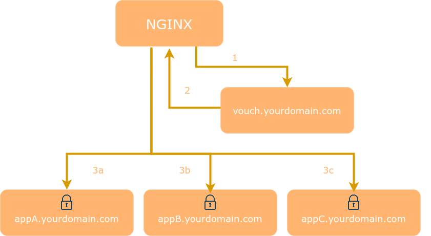

# Nginx SSO
## Description
This is a simple SSO Server based on nginx proxy. It is easy to install and setup.

## How does Nginx SSO work
Nginx SSO is working at domain level, It runs in the same one nginx deployment with web applications.

Nginx SSO forces visitors to login and authenticate before allowing them access to a website. Every request is checked to ensure that it is valid.



After authenticated, Nginx SSO sends the visitor's email to web applications.

## API
Nginx SSO provides following end points:

+ /login

+ /logout

+ /signup

+ /forgot

+ /validate

On validating successful, the email of loggined user is set in HTTP header named HTTP_REMOTE_USER.

## SSO Server Setup
1. Clone the repository
```
git clone https://github.com/lakedai/nginx-sso.git
```

2. Install dependencies
```
cd nginx-sso && composer install
```

3. Make sure nginx with php are configured correctly. Make sure web applications on nginx are working properly

4. Create user database. For mysql server, using following script:

  * vendor/delight-im/auth/Database/MySQL.sql

5. Edit settings in src/config.php

  * If email activation is enabled, make sure php mail() works properly

6. Edit settings in following files, __MAKE SURE__ the settings of api_scheme/api_host/api_port/inner_port are consistent

  * config/api.conf

  * config/conf.conf

## Nginx Configurations
1. Include __AT__ nginx's server level

  * config/api.conf

2. Include __INSIDE__ the server to be protected by SSO

  * config/validate.conf

3. To protect the whole server or any location of the server

4. (Optional) Include __INSIDE__ the server or the location to be protected

  * config/auth.conf

5. (Optional) Include __INSIDE__ the php block of the server or the location to be protected

  * config/id.conf

6. (Optional) Refer to an config example

  * config/default

## PHP Configurations
1. (Optional) Add email setting in php.ini

    If using msmtp to send email, codes like:
```
sendmail_path = "/usr/bin/msmtp -C /path/to/msmtprc -t"
```

## Web applications Setup
Web applications needs do following:

* Obtain the email value from HTTP header named HTTP_REMOTE_USER, login the user if not logined, and register new user if needed.

* Redirect to SSO login end point if no HTTP_REMOTE_USER HTTP header

* Redirect logout link to SSO logout end point.

* (Optional) Disable any original user login/register/forgot password lifecycle.
